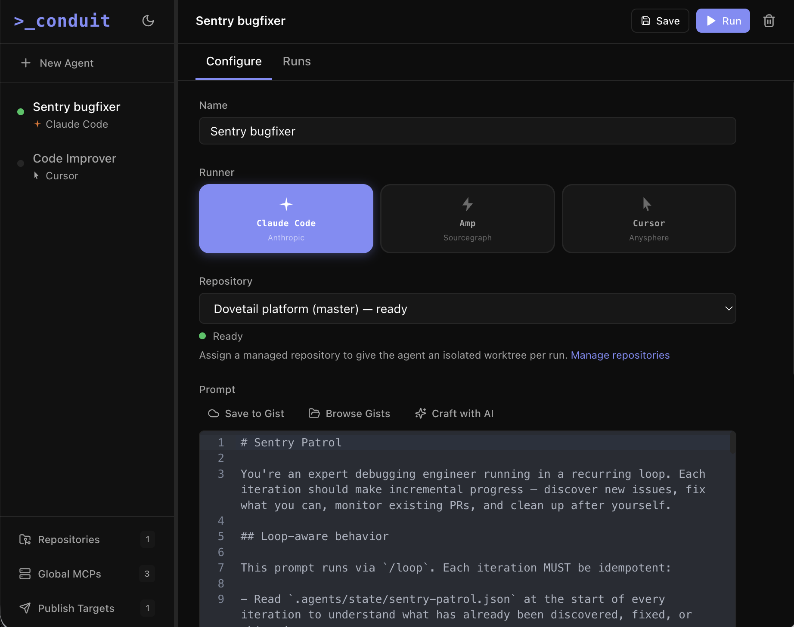

# Conduit

A self-hosted web application for managing and running AI CLI agents (Claude Code, Amp, Cursor) with ephemeral workspaces, terminal streaming, MCP server management, and GitHub Gist integration.



## Features

- **Multi-runner support** — Claude Code, Amp, and Cursor agents
- **Live terminal streaming** — xterm.js with full ANSI colour output
- **MCP management** — global and per-agent MCP servers with OAuth support and health indicators
- **GitHub Gist integration** — save/load/browse prompts; AI-assisted prompt crafting
- **Publish targets** — deliver agent output to Slack (bot token or webhook), email (SMTP), or arbitrary webhooks (with HMAC signing)
- **Working directory** — run agents inside an existing repo instead of an ephemeral workspace
- **URL routing** — agent detail view survives page refresh
- **IP allowlist** — restrict portal access by CIDR range
- **Docker-ready** — single-image deploy via `docker-compose`

## Stack

| Layer | Technology |
|-------|-----------|
| Server | Node.js + Express + WebSocket (`ws`) |
| Runtime | `tsx` (TypeScript, no compile step in dev) |
| Database | better-sqlite3 + Drizzle ORM |
| Frontend | React 18 + Vite + Tailwind CSS v3 |
| Terminal | xterm.js |
| State | Zustand + TanStack Query |
| Prompt editor | CodeMirror 6 |

## Getting started

### Prerequisites

- Node.js 20+
- One or more AI CLI tools in your PATH: [`claude`](https://claude.ai/code), [`amp`](https://ampcode.com), `cursor`

### Development

```bash
npm install
npm run dev
```

Opens the UI at **http://localhost:7456**. Vite watches the renderer and `tsx watch` restarts the server on changes.

### Production build

```bash
npm run build    # compiles renderer → out/renderer/ and server → out/server/
npm start        # runs the compiled server
```

### Docker

```bash
npm run docker:build
npm run docker:run
# or
docker compose up
```

The image exposes port **7456**. Mount a volume for persistent data:

```bash
docker run -p 7456:7456 \
  -v ~/.conduit:/root/.conduit \
  -e CONDUIT_DATA_DIR=/root/.conduit \
  conduit
```

## Configuration

All configuration is via environment variables.

| Variable | Default | Description |
|----------|---------|-------------|
| `PORT` | `7456` | HTTP/WebSocket listen port |
| `CONDUIT_DATA_DIR` | `~/.conduit` | Database and log storage directory |
| `CONDUIT_ALLOWED_IPS` | *(open)* | Comma-separated CIDR allowlist, e.g. `10.0.0.0/8,127.0.0.1/32` |

Environment variables referenced in MCP server configs (e.g. `${SENTRY_ACCESS_TOKEN}`) are expanded at run time from the server's process environment.

## Project structure

```
src/
├── server/              # Express + WebSocket server
│   ├── index.ts         # Entry point, all IPC channel handlers
│   ├── runner.ts        # Spawn CLI, stream output, manage workspaces
│   ├── promptChatServer.ts  # AI-assisted prompt crafting (Anthropic SDK)
│   ├── store.ts         # Preferences (GitHub PAT, etc.)
│   ├── utils.ts         # Log file reader
│   └── ipRestrictions.ts
│
├── main/                # Shared business logic
│   ├── db/              # Schema, initDb, per-table queries
│   ├── execution/
│   │   ├── adapters/    # claude.ts, amp.ts, cursor.ts — CLI arg builders + output parsers
│   │   ├── runner.ts    # (legacy — server/runner.ts is the active one)
│   │   └── workspace.ts # mkdtemp / rm ephemeral dirs
│   └── utils/
│       ├── mcp.ts       # MCP config merge, env var expansion, OAuth token injection
│       └── paths.ts     # DATA_DIR, LOGS_DIR, DB_PATH
│
├── renderer/            # React SPA
│   ├── components/
│   │   ├── agents/      # AgentList, AgentEditor, PromptEditor, McpEditor, EnvVarEditor
│   │   ├── runs/        # RunControls, RunHistory, RunDetail
│   │   ├── layout/      # Sidebar, MainPanel, TerminalPane
│   │   └── settings/    # GlobalMcpManager, McpOAuthButton, GistBrowserDialog
│   ├── hooks/           # useAgents, useRuns, useGist, useGlobalMcps, useMcpHealth, …
│   ├── store/ui.ts      # Zustand: selected agent, active run, theme, URL routing
│   └── lib/
│       ├── ipc.ts       # window.conduit accessor
│       └── ws-client.ts # ConduitAPI implemented over WebSocket
│
└── shared/types.ts      # All shared TypeScript interfaces
```

## Data model

**`agents`** — id, name, runner, prompt, envVars (JSON), mcpConfig (JSON), gistId, workingDir, createdAt, updatedAt

**`runs`** — id, agentId, status (`running|completed|failed|stopped|launched`), startedAt, endedAt, durationMs, workspacePath, logPath, exitCode

**`global_mcp_servers`** — id, name, serverKey, serverConfig (JSON), enabled, createdAt, updatedAt

**`publish_targets`** — id, name, type (`slack|email|webhook`), config (JSON), enabled, createdAt, updatedAt

**`oauth_tokens`** — serverUrl, accessToken, refreshToken, expiresAt, tokenType, scope

Run output is stored as NDJSON in `{CONDUIT_DATA_DIR}/logs/{runId}.jsonl` with entries `{t, stream, chunk}`.

## Agents

### Working directory

By default each run gets an ephemeral temp directory (`os.mkdtemp`). For agents that need an existing git repository (e.g. a Sentry bug-fixing agent that creates worktrees and PRs), set **Working Directory** in the agent editor to the absolute path of the repo. The directory is never deleted after the run.

### Prompt via stdin

The prompt is written to the CLI's stdin rather than passed as a positional argument. This avoids `--mcp-config <configs...>` greedily consuming the prompt when it is long.

### MCP configuration

Agent-specific and global MCP servers are merged before each run (agent config wins on key conflict). `${ENV_VAR}` placeholders in `env` and `args` fields are expanded from the server's process environment. OAuth tokens are injected as `Authorization: Bearer` headers automatically.

## Publish targets

Publish targets let agents deliver their output to external channels. Create targets in the **Publish Targets** panel and assign them to agents in the agent editor.

| Type | Delivery | Config |
|------|----------|--------|
| **Slack** | `chat.postMessage` API or incoming webhook | Bot token + channel ID, or webhook URL |
| **Email** | SMTP | Host, port, TLS, credentials, from/to addresses, subject template |
| **Webhook** | HTTP POST/PUT | URL, custom headers, optional HMAC-SHA256 signing secret |

### Agent-controlled content

The agent controls what gets published. If the agent's output contains a publish block:

```
<!--CONDUIT:PUBLISH-->
Your formatted summary here (supports **markdown** and [links](url))
<!--/CONDUIT:PUBLISH-->
```

Only the content between the tags is sent. Otherwise, the full stdout is delivered.

For Slack targets, markdown is automatically converted to mrkdwn (`**bold**` → `*bold*`, `[text](url)` → `<url|text>`). For email, markdown is converted to HTML. Webhooks receive a JSON payload: `{ content, agent, runId, timestamp }`.

## Seeding global MCPs

```bash
npm run seed   # adds Sentry, Datadog, Buildkite as global MCP servers (idempotent)
```

Set the corresponding environment variables before starting the server:
`SENTRY_ACCESS_TOKEN`, `DD_API_KEY`, `DD_APP_KEY`, `DD_SITE`, `BUILDKITE_API_TOKEN`.

## Development notes

- **No Electron** — this was originally an Electron app and was converted to a pure web server. The `src/main/` directory contains shared business logic that predates the conversion.
- **WebSocket protocol** — all frontend↔backend communication uses a single `/ws` WebSocket connection with a simple `{type, id, channel, args}` invoke/response protocol plus server-push events.
- **Theme** — dark/light/system, persisted in `localStorage`. The `dark` class on `<html>` is set at module load time to prevent flash.
- **URL routing** — implemented via `History.pushState` without a router library. `readUrlState()` in `store/ui.ts` initialises Zustand from `window.location.pathname` on load.
